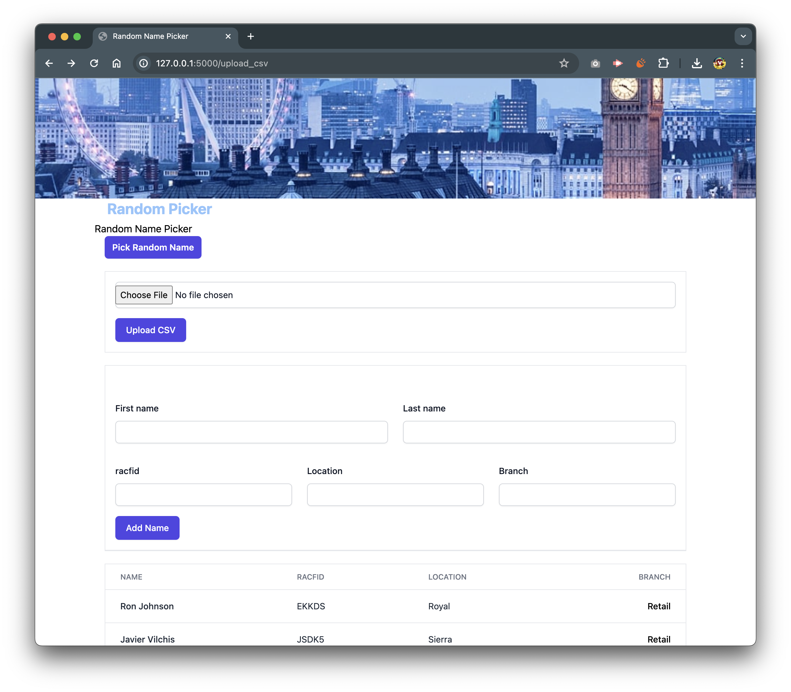

  

# Name Randomizer

This is a small project done to randomize names entered. This project is especifically for a table that includes specific colum titles.

This project has been developed with Python utilizing flask library and presented utilizing HTLM.

To run this project follow these steps:
1. clone the project.
2. once cloned go to the folder where you cloned into.
3. if you are using Mac OSX you can open your terminal and run the following command.
4. <code>python app.py</code> 

That is all, this will run the app on http://127.0.0.1:5000, this is where my localhost is running on, the port might vary depending on what port is available on your machine.

## How to use the application
You can add a list of names by importing a comma separated .csv file or you can add a name by completing the form.
After that, you click on the pick random name button. Then, this will show on a separate page your winning name with a bit of flare to make it interesting.

This is a free to download tool. I hope you enjoy it.

if you would like to contribute, please fork the project and submit a P.R., we will take a look at it and will merge it in if it makes sense. 

## Authors

- [@appsensedev](https://www.github.com/appsensedev)

## License

[MIT](https://choosealicense.com/licenses/mit/)

